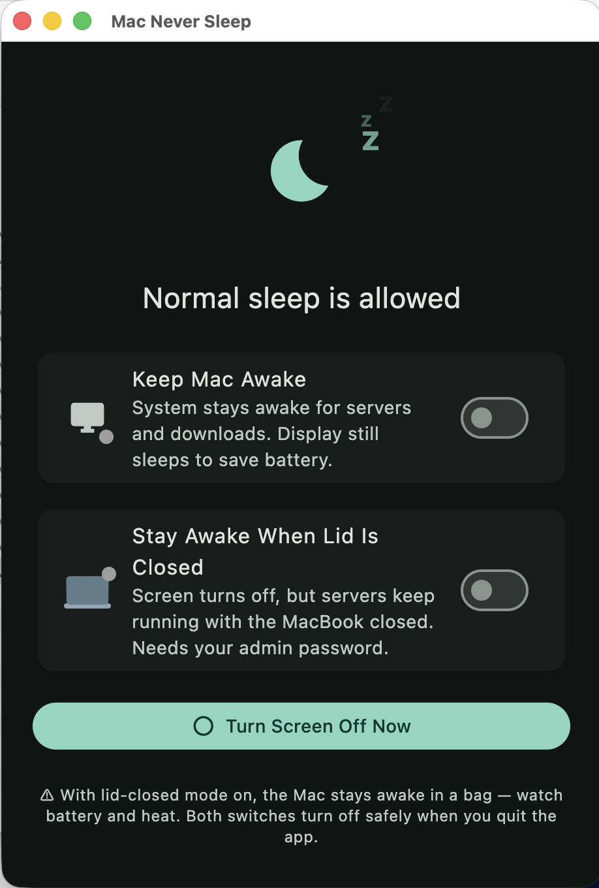
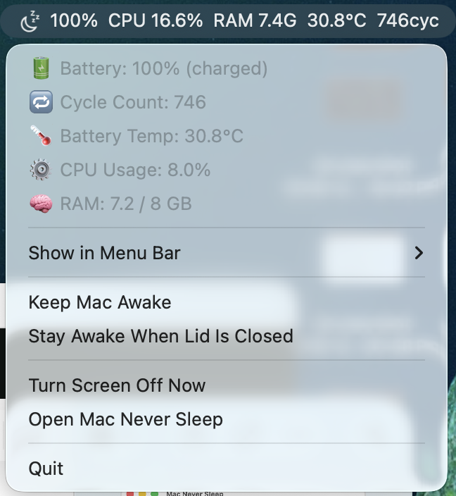

# Mac Never Sleep

A lightweight macOS menu bar app built with Flutter that keeps your Mac awake — even with the lid closed — so your servers, downloads, and background tasks keep running while the display stays off to save battery.

---

## Screenshots

| Main Window | Menu Bar |
|---|---|
|  |  |

---

## Features

### 🖥️ Keep Mac Awake
Prevents the system from sleeping due to inactivity. The **display still sleeps** on its normal schedule to save battery — only the system is held awake. Perfect for running a local server, downloading large files, or any background task that needs the CPU and network alive.

### 💻 Stay Awake When Lid Is Closed
Close the MacBook lid and the Mac keeps running instead of sleeping. The screen turns off automatically (it's a closed lid), so battery drain is minimal — just the work you're doing. Requires a one-time admin password prompt (macOS restriction, same as every app that does this).

### ⚫ Turn Screen Off Now
Instantly blacks the display with a single click — useful when you want to leave the Mac at your desk with the lid open but don't want the screen on.

### 📊 Live System Stats in the Menu Bar
The icon in the menu bar shows live stats next to it. Open the **"Show in Menu Bar"** submenu and check any combination:

| Stat | Example |
|---|---|
| Battery % | `100%` |
| CPU Usage | `CPU 16.6%` |
| RAM Used | `RAM 7.4G` |
| Battery Temp | `30.8°C` |
| Cycle Count | `746cyc` |

Your choices are saved and restored on next launch. Stats refresh every 15 seconds.

The full dropdown also shows detailed stats at a glance: battery state, cycle count, temperature, CPU and RAM.

### 🎬 Animated Status
The main window shows a live animation:
- **Sleep allowed** — floating *z z z* rising from a moon icon.
- **Awake** — steam rising from a glowing coffee cup ☕.
- Each toggle card has a mini animation showing exactly what it does: the display dims while a green server dot keeps blinking (system awake), and a laptop lid closes while the green dot keeps pulsing (lid closed, server running).

---

## How It Works

| Feature | macOS tool used |
|---|---|
| Keep Awake | `caffeinate -is` (no root needed) |
| Lid-closed Awake | `pmset -a disablesleep 1` (admin via osascript) |
| Turn Screen Off | `pmset displaysleepnow` |
| Stats | `pmset`, `ioreg`, `top`, `sysctl` |

When you quit the app, **both modes are turned off safely** — your Mac goes back to its normal sleep behaviour. If lid-closed mode was active, the app will ask for your admin password once more to restore it.

---

## Installation

### Run from source

```bash
git clone https://github.com/error404sushant/mac_never_sleep.git
cd mac_never_sleep
flutter pub get
flutter run -d macos
```

### Build a release app

```bash
flutter build macos --release
open build/macos/Build/Products/Release/mac_never_sleep.app
```

You can copy `mac_never_sleep.app` to `/Applications` to keep it permanently.

---

## Requirements

- macOS 10.14+
- Flutter 3.x

---

## Tips

- With **both switches on**, close the lid — the Mac runs your server silently with the screen off. Check with `pmset -g | grep SleepDisabled` (should be `1`).
- Leaving the lid-closed switch on while the Mac is in a bag causes heat and battery drain. Always quit the app or turn the switch off before packing up.
- If the menu bar icon is hidden by the MacBook notch, quit one other menu bar app to make room.

---

## Built With

- [Flutter](https://flutter.dev) — cross-platform UI framework
- [tray_manager](https://pub.dev/packages/tray_manager) — macOS menu bar integration
- [window_manager](https://pub.dev/packages/window_manager) — native window control
- [shared_preferences](https://pub.dev/packages/shared_preferences) — persisting user settings
